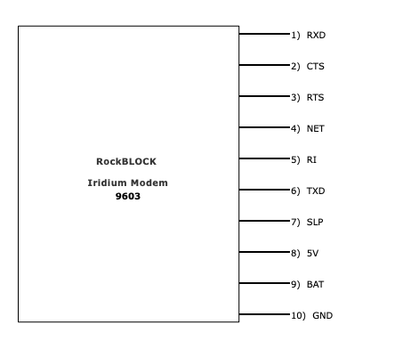

# ESP32-SX/CX Iridium Modem

## Overview

Drop-in C library for Iridium Short Burst Data (SBD) on ESP32 over UART AT commands. The driver runs an async pipeline (UART reader, command buffer, message delivery) with optional synchronous wrappers for sending commands and waiting for responses.

Supported hardware: [RockBLOCK 9603](https://cdn-shop.adafruit.com/product-files/4521/RockBLOCK-9603-Data-Sheet-Small.pdf)

## Dependencies

- [ESP-IDF](https://github.com/espressif/esp-idf/blob/master/tools/idf.py)
- [FreeRTOS](https://www.freertos.org)

## Project layout

| Path | Description |
|------|-------------|
| `iridium.c` / `iridium.h` | Main ESP32 driver |
| `iridium_parser.c` / `iridium_parser.h` | Pure AT/SBD parsing (host-testable) |
| `iridium_sim.c` / `iridium_sim.h` | Fixture replay / serial traffic simulator |
| `stack.c` / `stack.h` | UART response line stack |
| `examples/` | ESP-IDF example firmware |
| `scripts/build-and-flash.sh` | Build and flash helper |
| `scripts/modem_sim.py` | Python modem simulator for PTY testing |
| `test/host/` | Host unit tests and fixtures |

## Building and flashing

The example firmware lives in `examples/`. With [ESP-IDF](https://docs.espressif.com/projects/esp-idf/en/latest/esp32/get-started/index.html) installed and sourced:

```bash
source ~/esp/esp-idf/export.sh   # if IDF_PATH is not already set
./scripts/build-and-flash.sh
```

The script builds the example and flashes when an ESP32 is detected at `/dev/cu.usbmodem*` (macOS native USB, e.g. `/dev/cu.usbmodem1101`). If several `usbmodem` ports are present, it prompts you to choose one. With no `usbmodem` device, it falls back to any single serial port, or prompts when multiple are connected.

Options:

- `-m` / `--monitor` — flash, then open the serial monitor
- `-s` / `--skip-build` — flash only (skip `idf.py build`)

## Testing

Host tests run without hardware or ESP-IDF:

```bash
make test          # 19 unit tests (parser, framing, serial replay)
make replay        # replay mo_send_success fixture, print parsed state
make sim-dry-run   # preview Python modem traffic without a serial port
```

Replay any fixture:

```bash
./test/host/build/iridium_sim_replay test/host/fixtures/mt_ring_session.txt
```

To simulate a modem against real firmware over a virtual serial port, see [test/host/README.md](test/host/README.md).

CI runs `make test` on every push and pull request via `.github/workflows/test.yml`.

---

## Hardware



**NOTE**: Default baud rate is 19200. Most RockBLOCK pinouts use 3.3 V logic.

| Pin | Function |
|-----|----------|
| RXD | Serial output from modem |
| CTS | Clear to send |
| RTS | Ready to send |
| NET | Network available |
| RI | Ring indicator |
| TXD | Serial input to modem |
| SLP | Sleep control |
| 5V | 5 V power supply |
| BAT | 3.7 V power supply |
| GND | Ground |

RTS/CTS flow control is enabled automatically when both pins are configured (not `UART_PIN_NO_CHANGE`).

---

## Quick start

```c
#include "iridium.h"

static const char *TAG = "iridium_app";

void cb_satcom(iridium_t *satcom, iridium_command_t command, iridium_status_t status)
{
    if (status != SAT_OK) {
        return;
    }
    switch (command) {
        case AT_CSQ:
            ESP_LOGI(TAG, "Signal strength [0-5]: %d", satcom->signal_strength);
            break;
        case AT_SBDIX:
            ESP_LOGI(TAG, "MO status: %d", satcom->status_outbound);
            break;
        default:
            break;
    }
}

void cb_message(iridium_t *satcom, const char *data, size_t size)
{
    ESP_LOGI(TAG, "Inbound message (%u bytes): %.*s",
             (unsigned)size, (int)size, data);
}

void app_main(void)
{
    iridium_t *satcom = iridium_default_configuration();
    satcom->callback = cb_satcom;
    satcom->message_callback = cb_message;

    satcom->uart_number = UART_NUM_1;
    satcom->uart_txn_number = GPIO_NUM_17;
    satcom->uart_rxd_number = GPIO_NUM_18;
    satcom->uart_rts_number = UART_PIN_NO_CHANGE;
    satcom->uart_cts_number = UART_PIN_NO_CHANGE;
    satcom->gpio_sleep_pin_number = GPIO_NUM_N;  // or -1 if unused
    satcom->gpio_net_pin_number = GPIO_NUM_N;    // or -1 if unused

    if (iridium_config(satcom) != SAT_OK) {
        ESP_LOGE(TAG, "Modem init failed");
        return;
    }

    iridium_config_ring(satcom, true);

    iridium_result_t tx = iridium_tx_message(satcom, "hello");
    if (tx.status == SAT_OK) {
        ESP_LOGI(TAG, "Message sent");
    }
}
```

---

## Configuration

`iridium_default_configuration()` returns a heap-allocated `iridium_t` with sensible defaults. Set fields before calling `iridium_config()`:

| Field | Default | Description |
|-------|---------|-------------|
| `baud_rate` | `19200` | UART baud rate |
| `response_timeout_ms` | `30000` | Max wait for modem response |
| `buffer_size` | `10` | Outbound command queue depth |
| `message_queue_size` | `20` | Inbound message queue depth |
| `buffer_delay_ms` | `1000` | Buffer/message task poll interval |
| `task_uart_stack_depth` | `4096` | UART task stack (bytes) |
| `task_buffer_stack_depth` | `2048` | Buffer task stack |
| `task_message_stack_depth` | `4096` | Message task stack |
| `task_ring_stack_depth` | `4096` | Ring-indicator task stack |
| `gpio_sleep_pin_number` | `-1` | SLP pin (disabled) |
| `gpio_net_pin_number` | `-1` | NET pin (disabled) |

Callbacks are optional but recommended for command completion and inbound messages.

---

## API reference

### Lifecycle

```c
iridium_t *iridium_default_configuration(void);
iridium_status_t iridium_config(iridium_t *satcom);
iridium_status_t iridium_deinit(iridium_t *satcom);
```

`iridium_config()` installs UART, starts background tasks, and probes the modem with `AT`. `iridium_deinit()` stops tasks, uninstalls UART, and tears down queues.

### Messaging

```c
iridium_result_t iridium_tx_message(iridium_t *satcom, const char *message);
iridium_result_t iridium_rx_message(iridium_t *satcom, char *out, size_t out_len, size_t *received_len);
```

`iridium_tx_message()` writes the MO buffer (`AT+SBDWT`) then runs `AT+SBDIX` with adaptive retry. Messages must be ≤ `IRI_SBD_MAX_BYTES` (340).

`iridium_rx_message()` polls mailbox status (`AT+SBDSX`) and reads the MT buffer (`AT+SBDRT`) when data is waiting.

### Commands

```c
iridium_result_t iridium_send(iridium_t *satcom, iridium_command_t command, char *rdata,
                              bool wait_response, int wait_interval);
iridium_result_t iridium_config_ring(iridium_t *satcom, bool enabled);
iridium_status_t iridium_system_spec(iridium_t *satcom);
```

`iridium_send()` dispatches an AT command. When `wait_response` is true, it blocks until the modem replies or `response_timeout_ms` is reached.

Supported commands include `AT`, `AT+CSQ`, `AT+CGMI`, `AT+CGMM`, `AT+SBDSX`, `AT+SBDIX`, `AT+SBDIXA`, `AT+SBDWT`, `AT+SBDRT`, `AT+SBDMTA`, and configuration helpers (`AT&w0`, `AT&K0`).

### Power and availability

```c
iridium_status_t iridium_modem_sleep(iridium_t *satcom);
iridium_status_t iridium_modem_wake(iridium_t *satcom);
int iridium_is_available(iridium_t *satcom);
```

`iridium_is_available()` reads the NET GPIO pin. Returns `1` when the network is available, `0` when not, or `-1` if the pin is not configured.

### Status fields

After `AT+SBDIX` / `AT+SBDSX`, these fields on `iridium_t` are populated:

| Field | Description |
|-------|-------------|
| `status_outbound` | MO status (see `iridium_mo_status_t`) |
| `sequence_outbound` | MO message sequence number |
| `status_inbound` | MT status (see `iridium_mt_status_t`) |
| `sequence_inbound` | MT message sequence number |
| `bytes_received` | MT message length |
| `messages_waiting` | MT messages queued at gateway |

MO success codes: `0`, `1`, `2`. Common failure: `32` (no network service).

### Callbacks

```c
typedef void (*iridium_event_callback_t)(iridium_t *satcom, iridium_command_t command,
                                         iridium_status_t status);
typedef void (*iridium_message_callback_t)(iridium_t *satcom, const char *data, size_t size);
```

`callback` fires when a command completes (e.g. `AT_CSQ`, `AT_SBDIX`). `message_callback` fires for inbound SBD payloads delivered via `AT+SBDRT` or the ring task.

---

## Serial simulation

Recorded modem transcripts can be replayed for testing without a satellite link. Fixtures live in `test/host/fixtures/`:

```text
AT+SBDWT=hello       # device TX (lines starting with AT)
OK                   # modem RX
AT+SBDIX
+SBDIX: 0,42,1,17,25,0
OK
```

See [test/host/README.md](test/host/README.md) for fixture format, replay CLI, and Python PTY simulator setup.

---

## Contributing

When contributing to this repository, please first discuss the change you wish to make via issue,
email, or any other method with the owners of this repository before making a change.

Please note we have a code of conduct, please follow it in all your interactions with the project.

### Pull request process

1. Ensure any install or build dependencies are removed before the end of the layer when doing a build.
2. Update the README.md with details of changes to the interface, this includes new environment variables, exposed ports, useful file locations and container parameters.
3. Run `make test` and confirm all host tests pass.
4. You may merge the Pull Request once you have the sign-off of two other developers, or if you do not have permission to do that, you may request the second reviewer to merge it for you.

## Code of Conduct

### Our Pledge

In the interest of fostering an open and welcoming environment, we as
contributors and maintainers pledge to making participation in our project and
our community a harassment-free experience for everyone, regardless of age, body
size, disability, ethnicity, gender identity and expression, level of experience,
nationality, personal appearance, race, religion, or sexual identity and
orientation.

### Our Standards

Examples of behavior that contributes to creating a positive environment
include:

* Using welcoming and inclusive language
* Being respectful of differing viewpoints and experiences
* Gracefully accepting constructive criticism
* Focusing on what is best for the community
* Showing empathy towards other community members

Examples of unacceptable behavior by participants include:

* The use of sexualized language or imagery and unwelcome sexual attention or
advances
* Trolling, insulting/derogatory comments, and personal or political attacks
* Public or private harassment
* Publishing others' private information, such as a physical or electronic
  address, without explicit permission
* Other conduct which could reasonably be considered inappropriate in a
  professional setting

### Our Responsibilities

Project maintainers are responsible for clarifying the standards of acceptable
behavior and are expected to take appropriate and fair corrective action in
response to any instances of unacceptable behavior.

Project maintainers have the right and responsibility to remove, edit, or
reject comments, commits, code, wiki edits, issues, and other contributions
that are not aligned to this Code of Conduct, or to ban temporarily or
permanently any contributor for other behaviors that they deem inappropriate,
threatening, offensive, or harmful.

### Scope

This Code of Conduct applies both within project spaces and in public spaces
when an individual is representing the project or its community. Examples of
representing a project or community include using an official project e-mail
address, posting via an official social media account, or acting as an appointed
representative at an online or offline event. Representation of a project may be
further defined and clarified by project maintainers.

### Enforcement

Instances of abusive, harassing, or otherwise unacceptable behavior may be
reported by contacting the project team at [INSERT EMAIL ADDRESS]. All
complaints will be reviewed and investigated and will result in a response that
is deemed necessary and appropriate to the circumstances. The project team is
obligated to maintain confidentiality with regard to the reporter of an incident.
Further details of specific enforcement policies may be posted separately.

Project maintainers who do not follow or enforce the Code of Conduct in good
faith may face temporary or permanent repercussions as determined by other
members of the project's leadership.

### Attribution

This Code of Conduct is adapted from the [Contributor Covenant][homepage], version 1.4,
available at [http://contributor-covenant.org/version/1/4][version]

[homepage]: http://contributor-covenant.org
[version]: http://contributor-covenant.org/version/1/4/
